#XDF 2018 Workshop Machine Learning for Embedded on the Ultra96

## Introduction
This lab is based on the XDF 2018  Machine learning for Embedded Workshop. It has been modified to run on the Ultra96 board.

During this session you will gain hands-on experience with the Xlinx DNNDK, and learn how to quantize, compile and deploy pre-trained network models to Xilinx embedded SoC platforms. 

### Overview of DNNDK flow
The architecture DNNDK and its development flow are pictured below:

**Elements of DNNDK:**
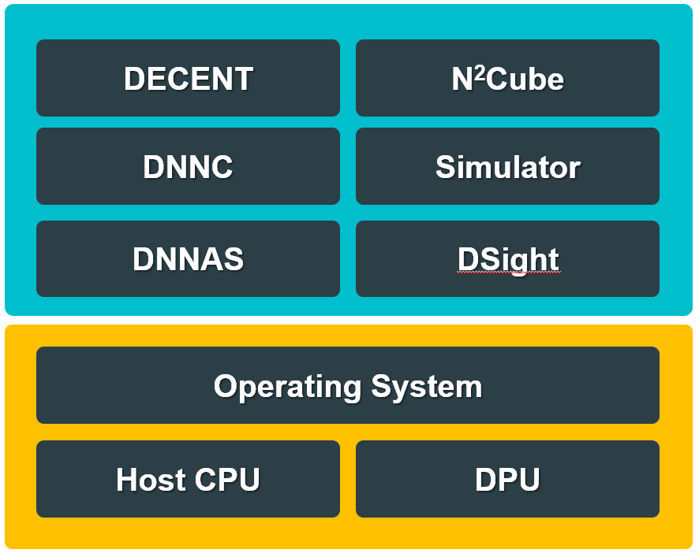

**DNNDK Flow:**
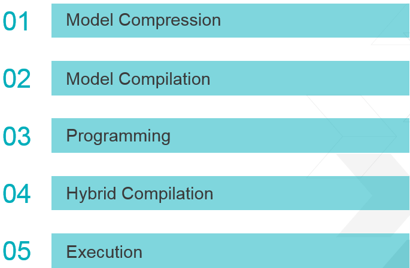

**DNNDK Compilation Process:**
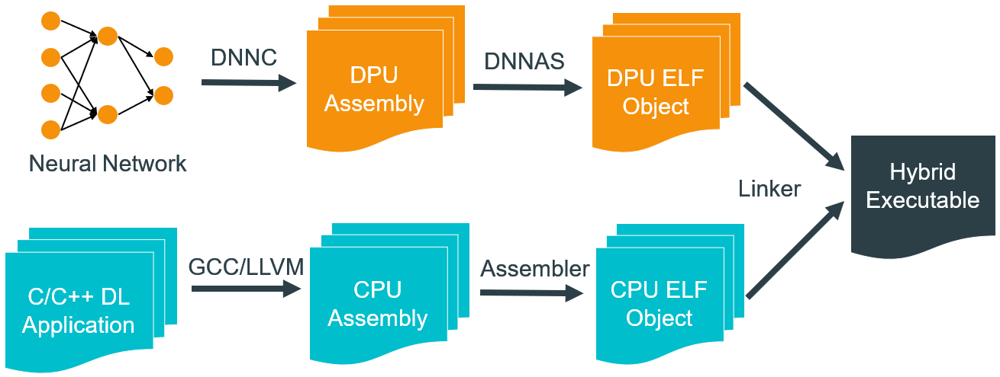

1. DNNDK is a tool suite which is designed specifically to deploy deep neural networks(DNNs) to Xilinx FPGA platforms with high efficiency and productivity.
2. DNNDK is comprised of quantizer, compiler, assembler, linker, and other useful utilities such as profiler, simulator and run-time libraries to increase the productivity of developing DNN applications with Xilinx embedded platforms.
3. An embedded DNN application consists of a hybrid executable including Xilinx Deep-learning Processing Unit (DPU) kernels in the programmable logic(PL) region and CPU kernels in the processor(PS) of Xilinx embedded SoC. 
4. DNNDK provides high-level user-space APIs in C++ to hide the low-level details for machine learning algorithm and application developers.

### Overview of the Machine Learning for Embedded Workshop modules

This developer workshop is divided into 4 modules. You should complete each module before proceeding to the next.

1. **Connecting to your P2 instance**: You will start an EC2 P2 instance connect to it using SSH. You can either use a terminal program like PuTTy, or MobaXterm.
 
2. **Experiencing DNNDK with Resnet50**: Let us start with a classical image classification example. In this module you experienced the quantization, compilation and deployment of pretrained Resnet50 with DNNDK for Xilinx embedded platform

3. **Try face detection with Densebox**: Let us try a live-I/O machine learning example which is more interactive. You will build a real-time face detection application with Densebox network using a USB camera.

4. **Wrap-up and next steps**: Explore next steps to continue your DNNDK experience after the machine learning for embedded Workshop.


For your convenience, all the modules of this Developer Workshop will use the scripts and datasets which have been prepared for you.

## Log in AWS and Launch the Instance

You should have received the following:

A piece of paper which has the user name which will be a userxxx (for example user6)

A link to the login to AWS

A password 

If you don’t have it, please raise your hand and ask for help.

    Login to AWS, and make sure you have the correct user number in your link.

   
For example, if you user name is user6, the the link should be something similar **(note your region might be different from us-west)** to:
**https://console.aws.amazon.com/ec2/v2/home?region=us-west-2#Instances:tag:Name=user6;sort=tag:Name**
    
Use the following login information


    Account ID: xilinx-aws-f1-developer-labs
    IAM User name: userxxx (for example: user6)
    Password: (will be provided)


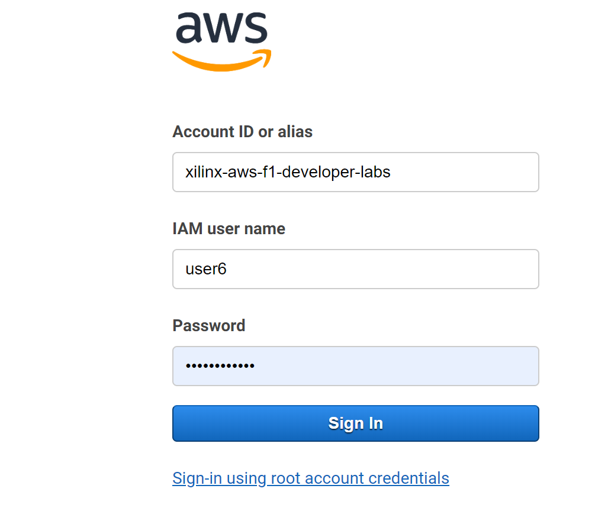
    

  
After logging in you should see an instance corresponding to **your provided user name**. If you see a different user name, you have logged into the wrong machine, and you need to logout and login with the correct link and user name.

    Select the instance associated with your user name
    click __*Actions > Instance State > Start*__. 
    Then click "Yes, start" button in the Start Instances dialog. 
   
**AWS Instances:**
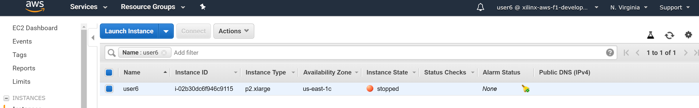


The startup time is about 10 ~20 seconds and you need to refresh the browser to see the status update. You will see the instance state becomes running and there is an IPv4 public IP address associated with it. Later, you will use this IP address for SSH or Remote Desktop Connection to access the working directory. 
   
**AWS Instance Runing:**
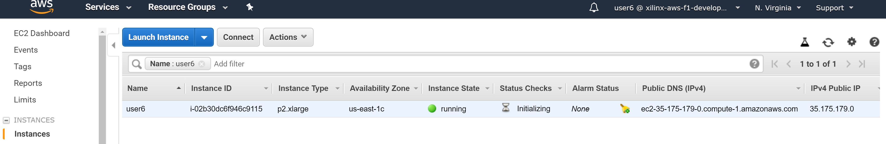


### Connect to your instance using SSH
Please use **MobaXterm** as your SSH client. We will taking advantage of its easy ability to copy files back to you host machine.

If you do not have **MobaXterm** installed, you can download it from:https://mobaxterm.mobatek.net/download.html

    In the SSH client start a new SSH sessionm, use the IPv4 Public IP of your AWS instance and ubuntu for the host name
    For the pass word use the same as the AWS login


You should now have a terminal prompt


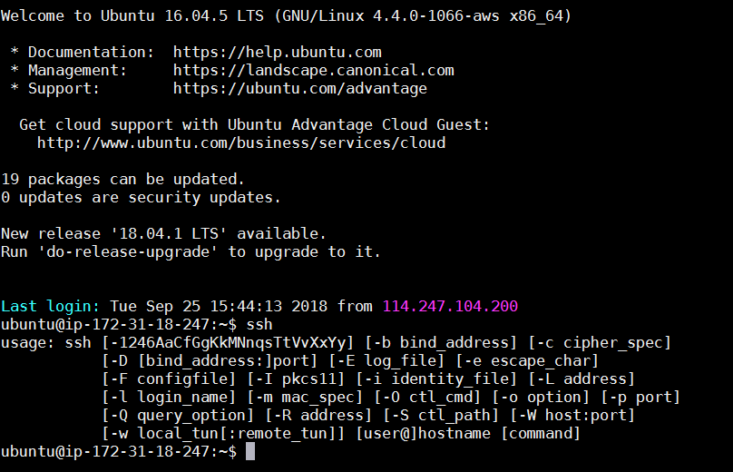


Go to the the working directory 

    cd ~/dnndk/Ultra96
    ls

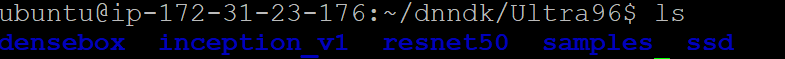

You can see there are six folders which are respectively,

- densebox: lab files for face detection with Densebox
- inception_v1: lab files for Inception V1(Googletnet)
- resnet50: lab files for resnet50
- ssd: lab files for SSD
- samples: C code source for incecption_v1

In today's lab we will be working with the resnet50 and densbox examples.


## Experiencing DNNDK with Resnet50

In this module you will have a hands-on experience of the Xilinx DNNDK to quantize, compile,and deploy to the Ultra96 board with a pre-trained Resnet50 network. 

Resnet50 (https://arxiv.org/abs/1512.03385) is an image classifier trained with the Imagenet dataset. 
You will go through the following steps,
1. Quantization to generate the fixed-point network model
2. Compilation to generate DPU kernels
3. View main.cc written with DNNDK APIs
4. Hybrid compilation to produce the executable for Ultra96 board
5. Run it the Ultra96 board to see the result

Look into ~/dnndk/Ultra96/resnet50: 

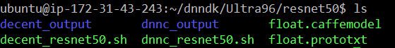

 The directories and files are organized as follows, 

* float.prototxt: 	pre-trained Caffe network model file to describe the network structure and parameter of each layer
* float.caffemodel:	pre-trained Caffe float-point (FP32) weight file
* decent: Xilinx's quantization tool
* dnnc:	Deep Neural Network Compiler
* decent_resnet50.sh: script for Resnet50 quantization
* dnnc_resnet50.sh: script for Resnet50 compilation
* decent_output: the output folder of Resnet50 quantization
* dnnc_output: the output folder of Resnet50 compilation

The directory and file arrangement of Inception_v1 and SSD are very similar. 

If you have interest, feel free to have a look into float.prototxt in ~/dnndk/Ultra96/resnet50/

The first layer on top is ImageData type with calibration images for the quantization. DNNDK does not support the mean file e.g. mean.binaryproto. Instead we use 3 mean values as shown below. 

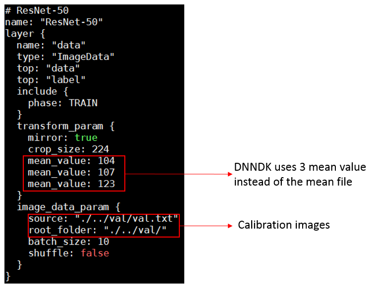

At the bottom of float.prototxt, two 'Accuracy' type layers have been added to compute top-1 and top-5 accuracy. 

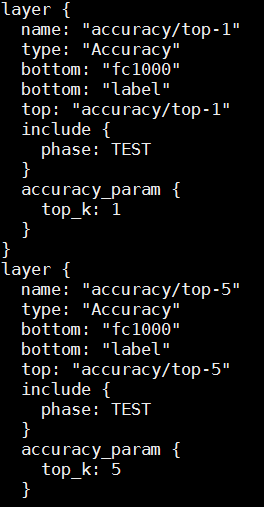

### Quantization with decent

decent is used to convert a pre-trained floating point (FP32) network model to a fix-point (INT8) model without hurting the accuracy. Using 8-bit calculations help your models run faster and use less power. This is especially important for many embedded applications that can't run floating point code efficiently.

The network models we use are trained by Caffe. 

We've created a script decent_resnet50.sh for you. 

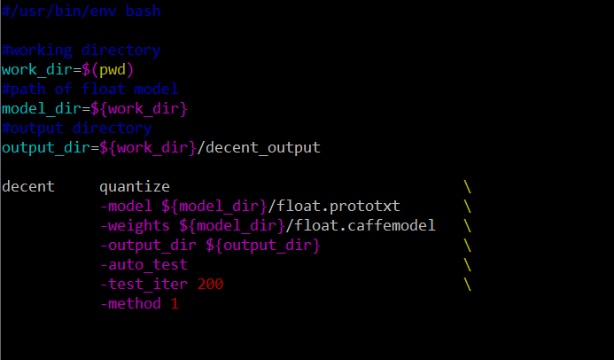

The command above quantizes the float-point model and automatically checks the accuracy of the quantized model.

Run: 
```
./decent_resnet50.sh
```

It takes about 4 minutes to complete.

During the execution, you can see some output information scrolling on the screen. The figure below shows how DNNDK uses calibration technique to measure the dynamic range of each layer without the time-consuming retrain process. 
          
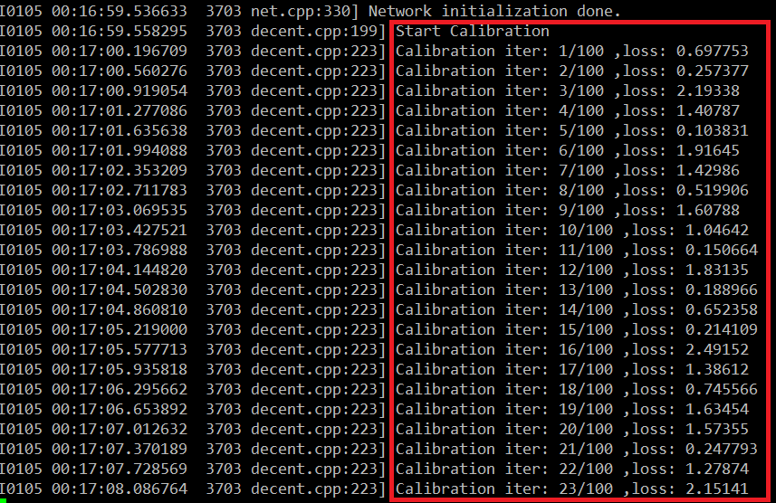
          
At the end, it checks the accuracy of the quantized model and generates the deploy.prototxt and deploy.caffemodel which are the input to the next step. 

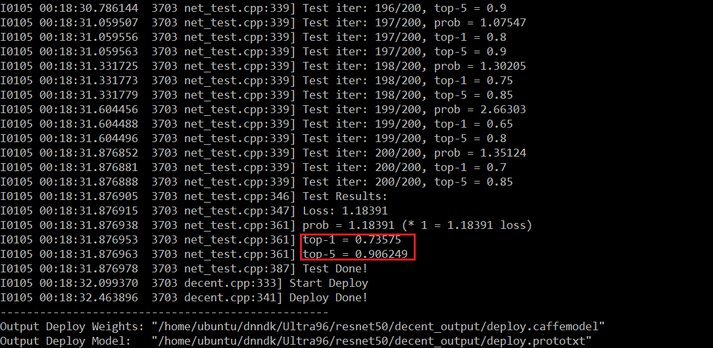
          
This concludes the quantization process. We successfully quantized the float-point Resnet50 model to the fix-point model and achieved with a good accuracy (top-1 0.736 top-5 0.906) vs float-point accuracy (top-1 0.744, top-5 0.914). The decent quantization is simple, fast and accurate. 

Let us go to the next step. 


### Compilation with dnnc

In this step, you will use dnnc, Deep Neural Network Compiler, to compile the quantized fixed-point model into DPU kernels which are ELF format object files containing the DPU instructions and parameters for the network model. Please note DPU is Xilinx Deep Learning IP core for Xilinx Embedded devices.

The DNNDK compilation has two phases: the 1st phase (run on AWS) uses dnnc to generate DPU kernel ELF files; the 2nd phase (run on the Ultra96 board), which is the hybrid compilation. In hyrbrid compilation all the DPU and CPU ELF object files and other necessary libraries (including DNNDK libraries) are linked together to generate the final executable. 

At this time, you will go through the 1st phase. 

A script dnnc_resnet50.sh has been created. 

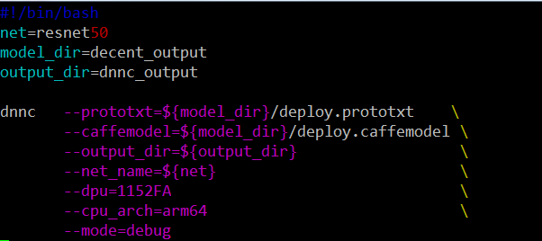

If you want to understand the meaning of the parameters of dnnc, just run dnnc

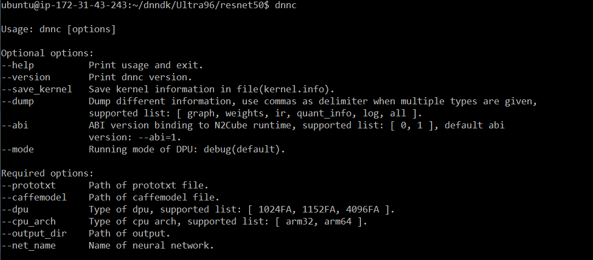

In this case, we target the Ultra96 platform which uses Cortex-A53 based ZU3EG device, so the option “arm64” is used and the DPU IP core option “1152FA” is chosen for dnnc. The details of the DPU IP core are beyond the scope of this workshop.

Run dnnc:
```
./dnnc_resnet50.sh 
```

It takes about 1 minutes to complete. 2 kernels are generated. Kernel resnet50_0 will run on DPU, including CONV, BN, POOL, RELU, FC layers while Kernel resnet50_1 will run on ARM to implement the softmax layer. 

In general, if a certain layer cannot run on DPU, it will be executed on ARM. So the networks will be automatically partitioned into several segments by the dnnc compiler. Each segment corresponds to one kernel, either in DPU or CPU. 

Please contact Xilinx if you want to know if any specific layer has been supported by DNNDK/DPU. The details of layer support are beyond the scope of this workshop.
          
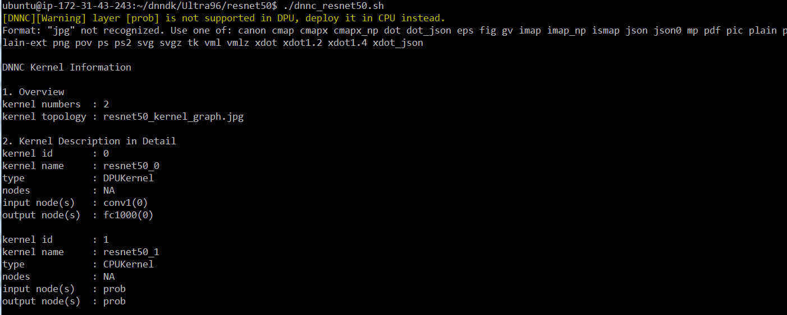
    
dpu_resnet50_0.elf is generated in dnnc_output folder, which are the output of dnnc. It corresponds to the DPU kernel described previously. This elf file will be used in the next phase to generate the final executables.

    cd dnnc_output
    ls

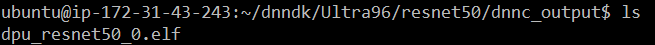

Copy the file dpu_resnet50.elf from the AWS instance to your host machine.

    In the MobaXterm Gui browse to the dir /home/ubuntu/dnndk/Ultra96/resnet50/dnnc_output/
    Right click on the file dpu_reset50.elf and select download


You are down using the AWS instance for the resnet50 example, however leave the instance running since you will be using it for the densebox face detection example.


### Connecting to the target Board

Prepare hardware environment:
   
The Ultra96 is used as the hardware platform for this workshop. A 16GB SD card which holds the boot image and necessary demo files has been provided as the boot device. 

A DP monitor is required as the display. In addition the Avnet USB to JTAG adaptor board is required for a serial port connection.


Use the serial terminal software such as puTTy, hyperterminal, or Xterm with the setting: 115,200 baud rate, 8 data-bit, 1 stop-bit and none parity.

To turn on the board:  press the power button.

To turn off the board: press and hold the power button for 10 seconds.

    Insert the SD card in the slot and power on

If needed:

    use root for the user name
    use root for the password

You should now see Linux booting from the serial terminal. 
 

### Use DNNAK APIs to program Resnet50 in main.cc 
Reminder: for the rest of this section you will be using your terminal connection to the Ultra96 **NOT** the terminal to the AWS instance.

**Helpful Hint:** You may want to close of minimize you SSH terminal to avoid the confusion of typing in the wrong terminal.

To simplify the machine learning application programming, high-level DNNDK APIs written in C++ are provided for developers to write a main.cc file. The main.cc is in charge of DPU kernel management, CPU kernel implementation as well as the interaction between kernels and the system such as video peripherals. 

main.cc file for Resnet50 is on the target board at /root/Ultra96/samples/resnet50/src/

    To examine this file you can run vi from on the terminal console
    Or for ease of viweing you can download a copy of the file from github repo: 
    https://github.com/jimheaton/Ultra96_ML_Embedded_Workshopsrc/resnet50/main.cc to view on an editor on your host machine.
    

Examine the code in main.cc to get familiar with DNNDK APIs. The following shows a code snippet of function main() in main.cc:

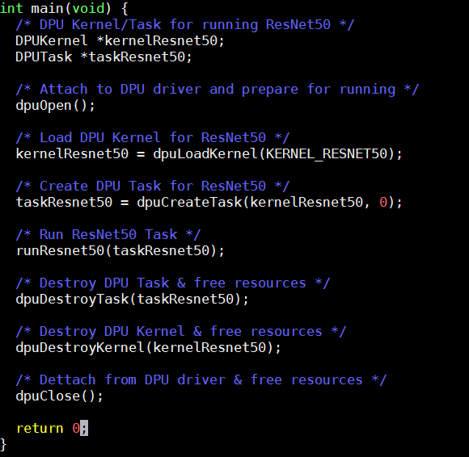
    
The main operations are: 

* Call __dpuOpen()__ to open DPU device

* Call __dpuLoadKernel()__ to load DPU kernel resnet50_0 & resnet50_2 generated by dnnc

* Call __dpuCreateTask()__ to create task for DPU kernel resnet50_0 & resnet50_2

* Call __runResnet50()__ to do image classification 

* Call __dpuDestoryTask()__ to destroy Task and free its resources

* Call __dpuDestroyKernel()__ to destroy Kernel and free its resources

* Call __dpuClose()__ to close DPU device 


Please make sure the kernel and node names are aligned with the output log in dnnc compilation, shown as follows,

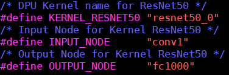
    
If incorrect node name is specified, the following kind of error will be reported while launching the running of ResNet50 demo:

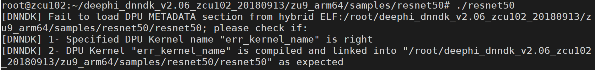

The following shows a code snippet of function runResnet50(): 

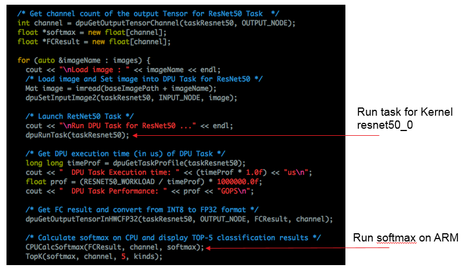

__runResnet50()__ does the following tasks: 

1. Read picture and set it as the input to DPU kernel resnet50_0 by calling dpuSetInputImage() API

2. Call dpuRunTask() to run Conv, Relu, Pool, FC operation etc. for DPU Kernel resnet50_0

3. Do Softmax operation on CPU using the output of full connection operation as input.

4. Output the top-5 classification category and the corresponding probability

For details of DNNDK APIs, please refer to DNNDK User Guide which can be downloaded from the Xilinx website - https://www.xilinx.com/support/documentation/user_guides/ug1327-dnndk-user-guide.pdf

### Hybrid Compilation & Running on Hardware Board

    Power off the Ultra96, and remove the SD card, and insert it in your host machine 
    Copy the dpu_resnet50_0.elf you downloaded from the AWS instance to the SD card 
    Insert the SD card and power back on the Ultra96.
  
The sd card should automatically be mounted after linux boots. Copy the dpu_resnet50_0.elf to the example directory with the following command:

    cp -f /media/card/dpu_resnet50_0.elf /root/Ultra96/samples/resnet50/model/

**Note: If you are unable to copy the files due limitation on your machine we have already copied an example to the model dir for you.**

Build the final executable with the following commands:
  
    cd /root/Ultra96/samples/resnet50
    make

Set the display envar for the remote display

    

Execute the resnet50 executable:
   
    ./restnet50	

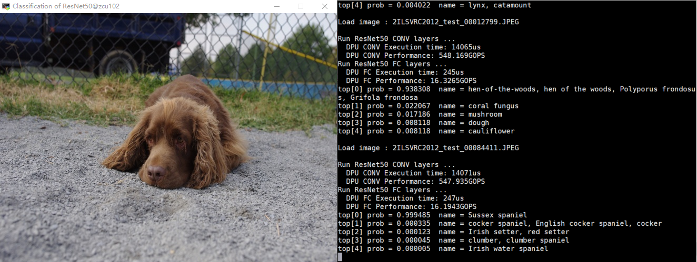

After the completion of this session, you have just learned how to: 

1. Quantize the pre-trained float-point network model to fixed-point quantized model


2. Check the network accuracy after the quantization

3. Compile the quantized model to generate ELF object files for DPU kernels

4. Have a basic understanding of programming main.cc with high-level DNNDK APIs

5. Make the hybrid compilation to generate the hybrid executables which runs on Xilinx embedded platform

6. Run the executables on Xilinx embedded platform to see the visual output

### Using the DSight Profiler
The DNNDK run time tools Contain Profile and Tracing capabilities

Now we will run the Dsight Profiler to see the effective utilization of the DPU

Set N2Cube run time tools to profile mode using the command:
 
    dexplorer -m profile

Rerun the resent50 application. You will note that execution has now slowed down due to the profiling. 

    ./resnet50
A file dpu_trace_[PID].prof will be generated. Next generate a html file using the command:

     dsight -p dpu_trace_[PID].prof

Now you can copy the html file to your host using the commands:

    cp /root/Ultra96/samples/resnet50/*.html /media/card/
    sync

Then

    Power off the Ultra96 and remove the SD Card and insert in your host machine
    Copy the html to your host machine and open up in a web browser

You should see something similar to:

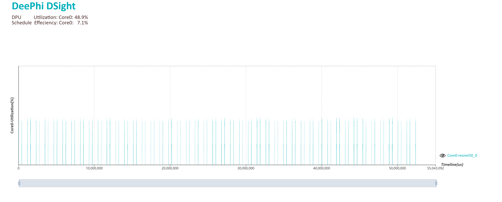

The average utilization (percentage of time the DPU is performing numerical ops) of the DPU should be about 50%
Note: GPUs typically have utilization below 20% for real time (batch size 1) inference like we have have just run.
 

## Try face detection with Densebox
It is easy to build a live-I/O embedded ML application with DNNDK. Now let us try to do real-time face detection with Densebox (https://arxiv.org/abs/1509.04874) using USB camera. Densebox is another popular object detection network with fully convolutional framework.

We will now move back to working with the AWS instance. 

**Helpful Hint**: you may want to minimize you serial port terminal to the Ultra96 to avoid the confusion of working in the wrong terminal.

Let us continue our experiment. 

    cd ~/dnndk/Ultra96/densebox
The content is shown below:
 
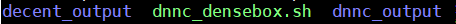

The Densebox network is already quantized and stored in the decent_output folder.

### Compilation with dnnc

Use dnnc_densebox.sh to compile the network into DPU kernel ELF file, the content of script is as follow:

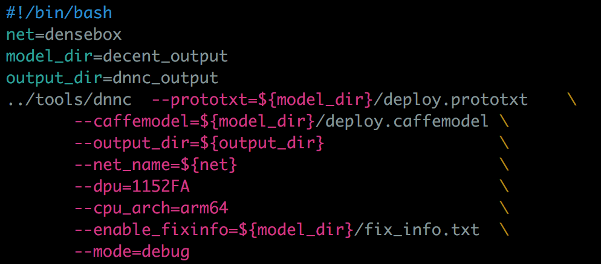

The kernel information is as follow:

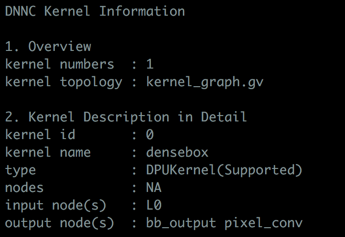

### Run densebox
    In the MobaXterm Gui browse to the dir /home/ubuntu/dnndk/Ultra96/densebox/dnnc_output/
    Right click on the file dpu_densebox.elf and select download
    Copy the elf file to the SD card, insert the SD Card into the Ultra96 and power back on.

Now we will go back to working on the Ultra96 board serial port terminal
    cp -f /media/card/dpu_densebox.elf /root/Ultra96/samples/face_detection/model/

**Note: If you are unable to copy the files due a limitation on your machine we have already copied an example to the model dir for you.**

Run Hybrid compilation:
 

    cd  /root/Ultra96/samples/face_detection
    make 

Run the executable:

    ./face_detection

You will see faces detected in real-time with bounding boxes like below:

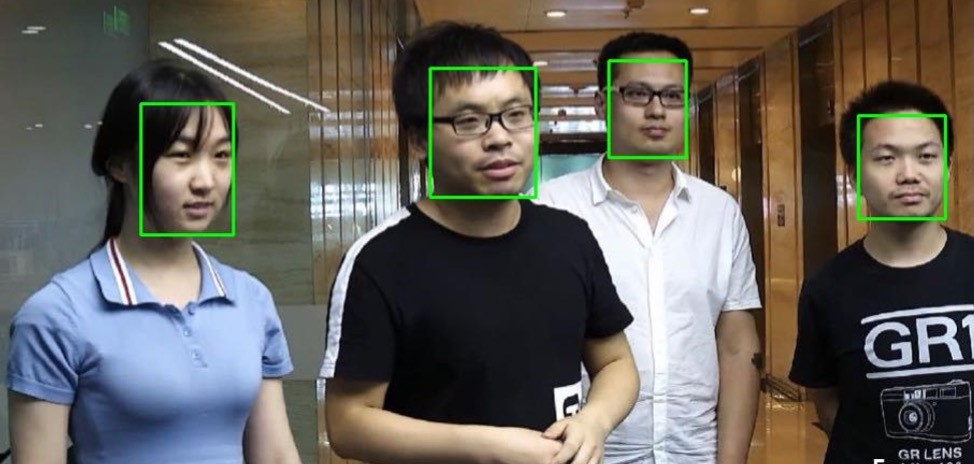

## Wrap-Up and Next Steps
### Congratulations!
You have successfully completed all the modules of Machine Learning for Embedded Workshop.

1. You started a pre-configured EC2 P2 instance and connected to it using a remote desktop client
2. You experienced the quantization, compilation and deployment of pretrained Resnet50 with DNNDK for Xilinx embedded platform
3. You have learned how to use the DNNDK Profiling tools
4. You built a real-time face detection demo with Densebox network using USB camera as input

If you have additional time and would like to try some more labs, you can skip to the **Additional Labs** section.
Otherwise stop the AWS instance. It is always important to always stop the AWS EC2 instances when you are done using them to avoid unwanted charges.

    In the EC2 Console, make sure your instance is selected
    Click the Actions > Instance State > Stop

After about 1 minute please refresh your browser and verify that the instance state is stopped:


### Next steps

To take your experience further, we recommend the following next steps:

1. Download the DNNDK user guide from https://www.xilinx.com/support/documentation/user_guides/ug1327-dnndk-user-guide.pdf and have a deeper understanding of how it works
2. Try to build a real-time pedestrian detection application with SSD using USB camera by reference to the face detection example

# Additional Labs


## Practicing DNNDK with Inception V1(Googlenet)

In this module you will get hands-on experience writing code in main.cc, and using a Makefile to build and run Inception V1(Googlenet) with DNNDK.
Inception V1 (https://arxiv.org/abs/1409.4842) is another popular image classifier trained with the Imagenet dataset.

You will go through the following steps,
1. Quantization to generate the fixed-point network model

2. Compilation to generate DPU kernels

3. Finish main.cc using DNNDK APIs and Makefile

4. Hybrid compilation to produce the executable for Ultra96 board

5. Run it on Ultra96 board to see the result

Change directory to ~/Ultra96/inception_v1. The directories and files are organized similar to the Resnet50 project, as shown below:

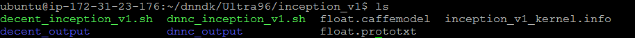

### Quantization with decent
The script **decent_ inception_v1.sh** is similar to the resnet50 script.

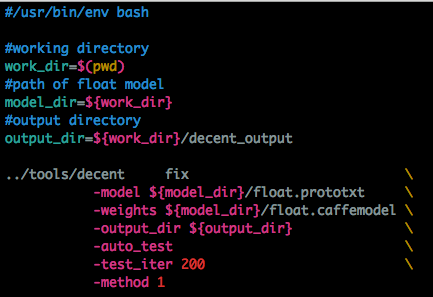

On your AWS terminal run decent with the following commands
     cd ~/dnndk/Ultra96/inception_v1
    ./decent_ inception_v1.sh

It takes about 4 minutes to complete. At the end, it checks the accuracy of the quantized model and generates the deploy.prototxt and deploy.caffemodel which are the input to the next step.

### Compilation with dnnc
In this step, use dnnc to compile the quantized fixed-point model into DPU kernels ELF files.

Run dnnc

    ./dnnc_ inception_v1.sh

It takes about 1 minutes to complete. 2 kernels are generated. Similar to Resnet50, kernel inception_v1_0 will run on DPU, while Kernel inception_v1_1 will run on ARM for softmax layer.

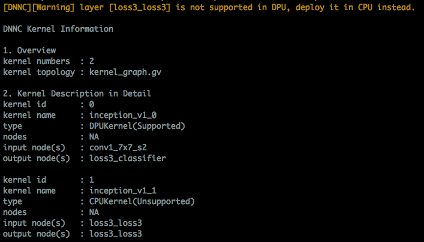

dpu_inception_v1_0.elf is generated in dnnc_output folder. It corresponds to one DPU kernel described above. The elf file and kernel/input/output node names will be used in the next step to generate the final executables. We have dumped the kernel info in the ~/dnndk/Ultra96/inception_v1/kernel.info log file for the later use.

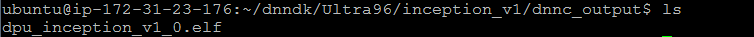

Copy the dpu elf file to your host machine:
    
    In the MobaXterm Gui browse to the dir /home/ubuntu/dnndk/Ultra96/inception_v1/dnnc_output/
    Right click on the file dpu_inception_v1_0.elf and select download

### Finish main.cc
We need you to finish the main.cc for this design. It is located in ~/dnndk/Ultra96/samples/inception_v1/src 
Please refer to main.cc and Makefile of the resnet50 project for an example of how to finish it.

Copy this file to your host machine for ease of editing:

    In the MobaXterm Gui browse to the dir /home/ubuntu/dnndk/Ultra96/samples/inception_v1/src/
    Right click on the file main.cc and select download


The missing elements of main.cc and the Makefile which you need to finish are shown in the following figures. Don’t worry if your code is incorrect. It will not cause any unrecoverable crashes. The message like undefined kernel or node will be displayed when you run it on the board.

**main.cc DEFINES**
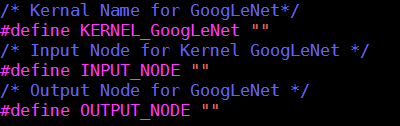

**main.cc Function**
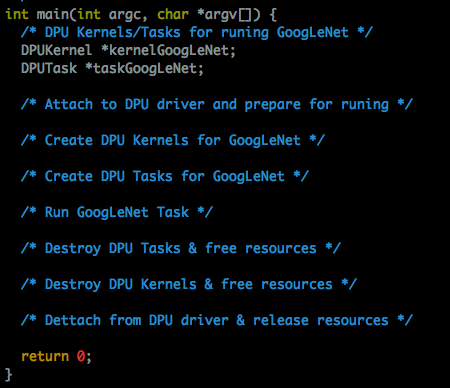


After you have completed the coding, you should have a better understanding of how to write application code with DNNDK APIs and how to use the generated DPU kernels in the compilation process.

If you are not able to finish the coding, which is not unusual for the first time, you can find the completed main.cc and Makefile in ~/dnndk/Ultra96/samples/inception_v1/.backup folder.
If you would like to download this:

    In the MobaXterm Gui browse to the dir /home/ubuntu/dnndk/Ultra96/samples/inception_v1/src/.backup/
    Right click on the file main.cc and select download

You are now down with the AWS instance for the rest of this lab.

Copy the completed main.cc to the Ultra96 board at ~/dnndk/Ultra96/samples/inception_v1/src 

### Copy Files on Ultra96 
Copy the DPU kernel elf file and main.cc to the Ultra96 with the following:

    Power off the Ultra96 board remove the SD Card, and insert in your host machine.
    Copy the dpu_inception_v1_0.elf file you downloaded and the main.cc file you edited to the SD Card

### Compile and Run
Then from the Ultra96 Linux prompt use the following commands:
  
     cp /media/card/dpu_inception_v1_0.elf /root/Ultra96/samples/inception_v1/model/
     cp /media/card/main.cc  /root/Ultra96/samples/inception_v1/src/

**Note: If you are unable to copy the files due a limitation on your machine we have already copied an example to the model and src dirs for you.**


     cd /root/Ultra96/samples/inception_v1
     make

The final executable file is generated in same folder. 

    ./inception_v1

You will see the following display with image and the top-5 probability.

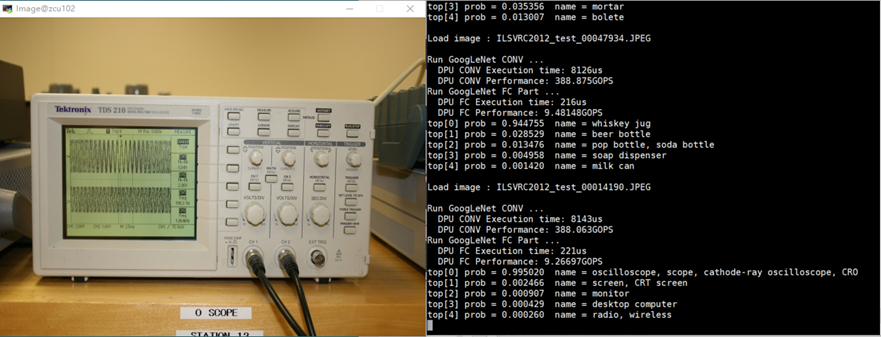


## Wrap-Up and Next Steps
If you would like to try the **Going Further with SSD** you can go directly to that section.
Otherwise, please stop the AWS instance. If youIt is always important to always stop the AWS EC2 instances when you are done using them to avoid unwanted charges.

    In the EC2 Console, make sure your instance is selected
    Click the Actions > Instance State > Stop

After about 1 minute please refresh your browser and verify that the instance state is stopped:


### Next steps

To take your experience further, we recommend the following next steps:

1. Download the DNNDK user guide from https://www.xilinx.com/support/documentation/user_guides/ug1327-dnndk-user-guide.pdf and have a deeper understanding of how it works
2. Try to build a real-time pedestrian detection application with SSD using USB camera by reference to the face detection example

## Going Further with SSD

In this module you will quantize, compile and deploy to the Ultra96 board with a pre-trained SSD network. 

SSD (https://arxiv.org/abs/1512.02325) is a commonly used real-time object detection network for a wide range of applications. The backbone of SSD can use different networks such as Resnet, VGG, Googlenet etc. In this experiment, we will use SSD with VGG16 as the backbone. 

The overall flow of SSD experiment is almost the same with the previous Resnet50 lab.

The working directory on your AWS instance is ~/dnndk/Ultra96/ssd/

     cd ~/dnndk/Ultra96/ssd/

It is quite straightforward to go through the lab by repeating the steps in Resnet50.

Run **decent** to quantize and generate deploy.prototxt and deploy.caffemodel in ~/dnndk/Ultra96/ssd/decent\_output

     ./decent_sdd.sh


Run **dnnc** to generate DPU kernel ELF file dpu_ssd.elf in ~/dnndk/Ultra96/ssd/dnnc\_output
     ./dnnc

Copy the elf file from AWS to your host machine:

    In the MobaXterm Gui browse to the dir /home/ubuntu/dnndk/Ultra96/ssd/dnnc_ouput/
    Right click on the file dpu_ssd.elf and select download

You are now down with the AWS Instance for the rest of this lab.


### Copy Files on Ultra96 
    Power off the Ultra96, remove the SD Card and insert it in your host machine.
    Copy the elf file you downloaded from AWS to the SD Card.
    Reinsert the SD Card into Ultra96 and power back on.

### Compile and Run
Then from the Ultra96 Linux prompt use the following commands:
  
     cp /media/card/dpu_ssd.elf.elf /root/Ultra96/samples/ssd/model/

**Note: If you are unable to copy the file due a limitation on your machine we have already copied an example to the model  dir for you.**

     cd /root/Ultra96/samples/ssd
     make

To run the application use:

     ./video_analysis vido/structure.mp4


You will see the following display with bounding box around different classes of objects.
The input image size is 480x360 and we can achieve 28 fps.

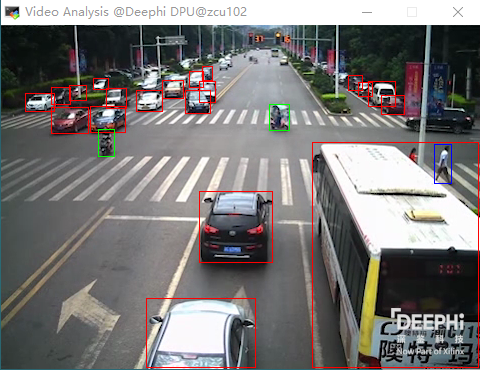

We are successfully running a modern object detection network to detect the vehicles, motorcycles and pedestrians in the city traffic in real time on an embedded platform. This is done within a few minutes with the help of DNNDK.

After completing this section, you have:

1. Become more familiar with the DNNDK end-to-end flow by repeating the steps
2. Be able to build a real-time multi-class object detection demo on Xilinx embedded platform in minutes.

## Wrap-Up and Next Steps
If you would like to try the **SSD Lab** you can go to that section.
Otherwise, please stop the AWS instance. If youIt is always important to always stop the AWS EC2 instances when you are done using them to avoid unwanted charges.

    In the EC2 Console, make sure your instance is selected
    Click on Actions > Instance State > Stop

After about 1 minute please refresh your browser and verify that the instance state is stopped:


### Next steps

To take your experience further, we recommend the following next steps:

1. Download the DNNDK user guide from https://www.xilinx.com/support/documentation/user_guides/ug1327-dnndk-user-guide.pdf and have a deeper understanding of how it works
2. Try to build a real-time pedestrian detection application with SSD using USB camera by reference to the face detection example